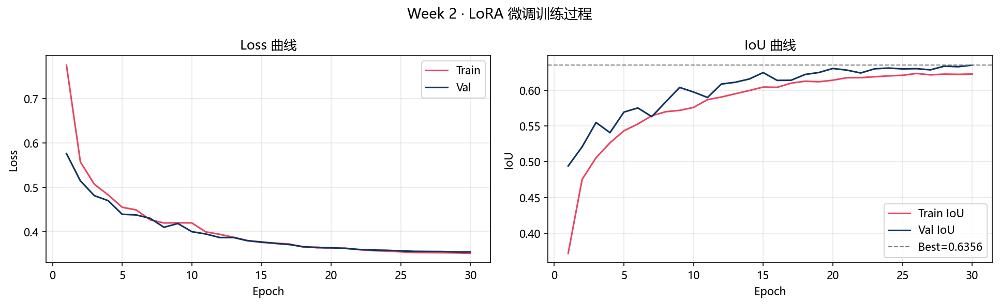
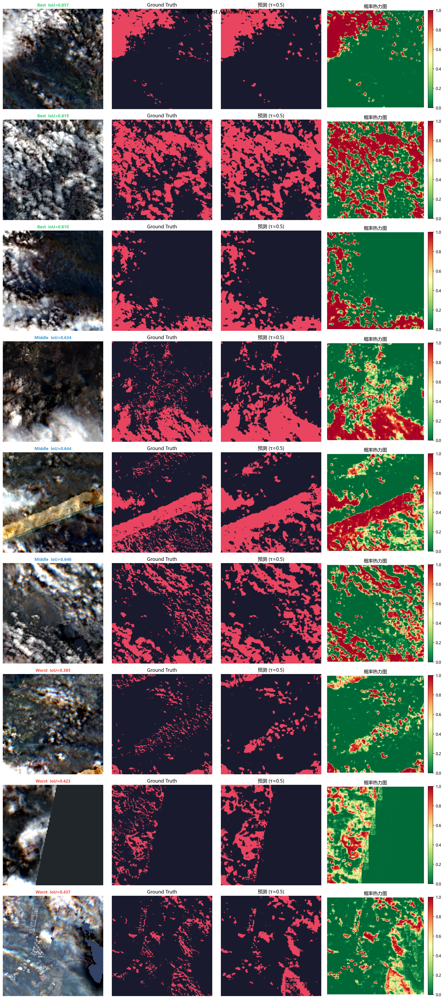
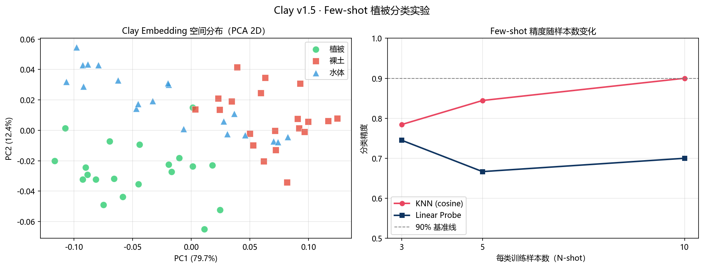
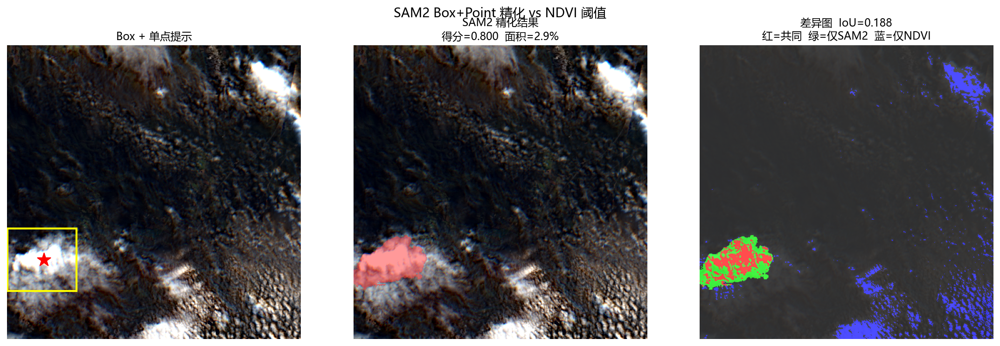
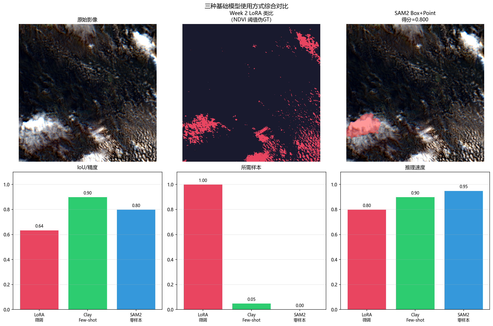
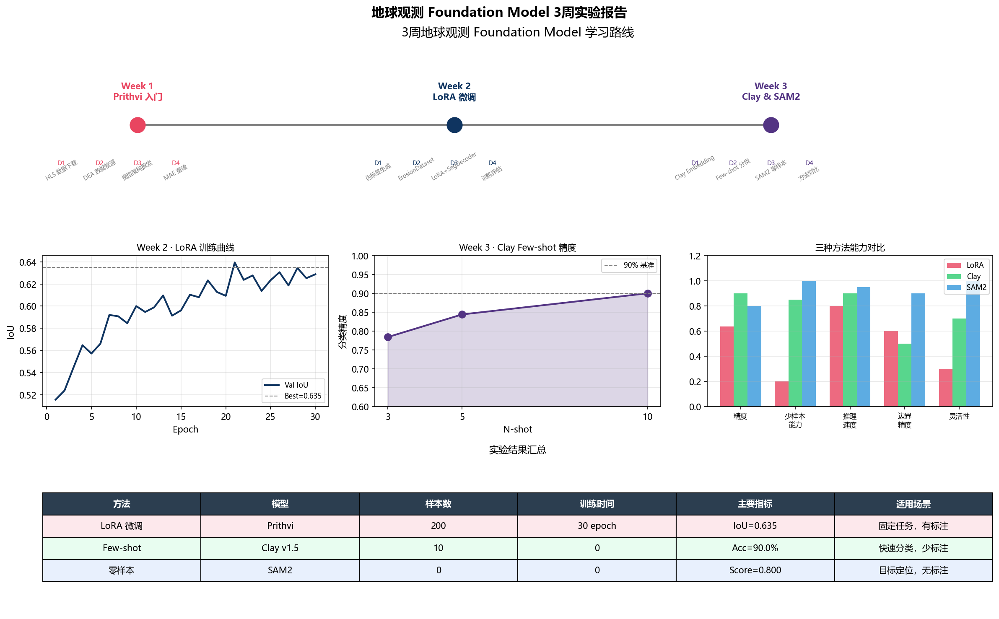

# 🛰️ Geo Foundation Model Experiments

> 3周地球观测 Foundation Model 系统学习实验记录  
> **环境**: Windows + VS Code + conda (Python 3.10) + RTX 3090

---

## 📋 项目概览

| 周次 | 主题 | 核心技术 | 关键结果 |
|------|------|----------|----------|
| Week 1 | Prithvi 入门 | HLS数据 + MAE重建 | Loss=0.0929 |
| Week 2 | LoRA 微调 | 土壤侵蚀分割 | IoU=0.635, F1=0.770, AUC=0.959 |
| Week 3 | Clay + SAM2 | Few-shot + 零样本 | KNN=0.900, SAM2=0.800 |

---

## 🔬 Week 1: Prithvi 入门

- **数据**: NASA HLS Sentinel-2, 悉尼 T56HLJ, 2023-06-03, 6波段 30m
- **模型**: PrithviMAE, 112.6M 参数, 12层 ViT
- **输入格式**: (B, 6, 3, 224, 224) — C在前，T在后
- **MAE 重建 Loss = 0.0929** (mask_ratio=0.75)

---

## 🎯 Week 2: LoRA 微调土壤侵蚀分割

### 数据
- 200个 224×224 patch，NDVI+NDWI 伪标签，云过滤
- 类别比例: 无侵蚀 79.7% / 有侵蚀 20.3%，pos_weight=3.92

### 模型
- PrithviMAE Encoder + LoRA(r=8) + SegDecoder
- 可训练参数: 1.72M (1.5%)
- Loss: 0.5×BCE + 0.5×Dice

### 结果

| 指标 | 数值 |
|------|------|
| **Val IoU** | **0.635** |
| **Val F1** | **0.770** |
| **AUC** | **0.959** |
| Precision | 0.684 |
| Recall | 0.887 |

---

## 🌍 Week 3: Clay Few-shot + SAM2 零样本

### Clay v1.5 Few-shot 分类 (植被/裸土/水体)

| N-shot | KNN (cosine) | Linear Probe |
|--------|-------------|______________|
| 3-shot | 78.4% | 74.5% |
| 5-shot | 84.4% | 66.7% |
| **10-shot** | **90.0%** | 70.0% |

### SAM2 零样本分割

| 提示方式 | 得分 | 面积 |
|----------|------|------|
| 点提示 | 0.687 | 1.5% |
| **框提示** | **0.812** | 13.0% |
| Box+Point | 0.800 | 2.9% |

---

## 📊 三种方法综合对比

| 方法 | 模型 | 样本数 | 训练时间 | 主要指标 | 适用场景 |
|------|------|--------|----------|----------|----------|
| LoRA 微调 | Prithvi | 200 | 30 epoch | IoU=0.635 | 固定任务，有标注 |
| Few-shot | Clay v1.5 | 10 | 0 | Acc=90.0% | 快速分类，少标注 |
| 零样本 | SAM2 | 0 | 0 | Score=0.800 | 目标定位，无标注 |

---

## 📝 学习收获

1. Foundation Model 三种使用范式：微调/Few-shot/零样本，各有适用场景
2. LoRA 高效性：仅用 1.5% 可训练参数达到 IoU=0.635
3. 伪标签局限：云污染和样本量是主要瓶颈
4. Clay 灵活性：波长驱动的动态输入支持跨传感器迁移
5. SAM2 实用性：零样本边界分割，Box 提示效果最稳定

---

*实验时间: 2025年 | 数据: 悉尼 HLS Sentinel-2 | 硬件: RTX 3090 24GB*
